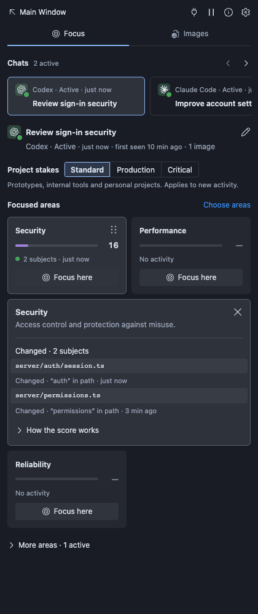
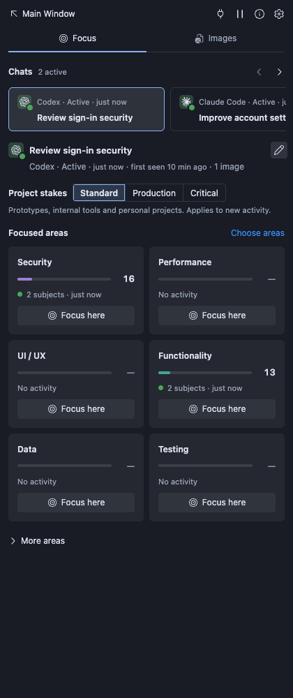
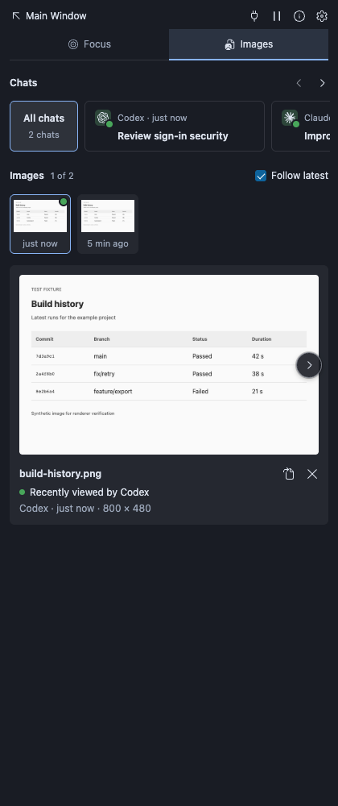

# Agent Monitor


Track **Codex, Claude Code and Cursor Agent** activity in one place. See which areas each chat is working on, inspect the tool evidence and images, and ask a specific chat to focus on Security, Performance, Testing or another area—all from your editor.

Agent Monitor collects local tool events and turns them into recent activity signals. Open it in the sidebar or a full editor tab. It requires no API key and adds no telemetry or model calls of its own; focus requests go to your existing agent chat. Scores describe observed activity, not work quality or completion.

This is a development preview. Collection is best effort, and native compatibility is still being validated.

## What it shows

- **Focus** — a strip of chats (provider, state, last activity and a two-line title) with one chat shown at a time, then areas such as Security, Performance, UI / UX and Testing. Each area has a 0–100 score and a meter in its own colour that fades as the evidence ages. Select an area for evidence; choose **Focus here** to ask that chat to give it attention. **Choose areas** controls which areas stay visible, and the six-dot handle reorders them or moves them to More areas. The selected chat shows its state and a rename control. Chats use the agent’s own title where available (Codex and Claude Code), and subagents’ work counts towards their parent chat rather than appearing separately.
- **Images** — a strip of the chats that used images (plus All chats), ordered by image activity, then a thumbnail history and a large preview with round previous/next controls on its edges. **Follow latest** stays on while you browse; only its checkbox turns it off. Click the picture to open it in an editor tab at full size. A red count on the tab marks images agents used since you last looked; opening the tab outlines them briefly.
- **Main Window** — opens the same monitor as a tab in the main editor area, with a wider grid and larger images.

<table><tr><td></td><td></td><td></td></tr></table>

All screenshots use synthetic fixtures generated by the renderer test.

## Build and install

Requirements: Node.js **22+** to build, Node.js **20+** on the agent's machine to collect events, and a compatible desktop editor. No API key is required.

From the repository root:

```sh
npm ci --ignore-scripts
npm run check
npm test
npm run package
```

In the editor, run **Extensions: Install from VSIX…** and select the versioned `.vsix` in `dist/`. There is no marketplace installation route configured in this preview.

1. Open a trusted local project. Agent Monitor opens once per editor-window startup.
2. Select **Set up**, or the plug icon at the top of the view, and connect the agent you use. If you do not use one of the listed agents, choose **I don’t use …** so it never warns again.
3. Follow its setup steps. Codex requires native `/hooks` trust review. For Claude Code, check that hooks are enabled and start a fresh session. Start a new Agent chat for Cursor.
4. Run a tool in that workspace. **Tool activity received** confirms receipt; installed settings alone do not.

The setup panel offers terminal, copy-command and settings actions. It does not grant native trust or override organisation policy. See [installation and troubleshooting](docs/INSTALLATION.md) for configuration, startup behaviour and removal.

## What the signals mean

**Focus scores run from 0–100.** They show the work a chat has put into each area. They build up gradually, are kept when a chat is idle or old, and fade only slowly as the chat works elsewhere; they are not completion or quality grades. Subject counts show observed breadth separately. A meter's colour fades when its evidence is not recent; its length stays. **Project stakes** (Standard, Production, Critical) add specialised vocabulary and mark sensitive changes, such as migrations, access control or safety logic, on the areas they concern. At the end of More areas, **Start now** (**Create your own Focus Area**) has your own agent draft a custom focus area for this project, such as a feature, service, integration, workflow or standard; it counts only after you review and enable it. See [custom areas](docs/CUSTOM-AREAS.md). In All chats, each tile shows the strongest individual chat score. Clear signals, such as a recognised test run or an `auth` path, count more than ambiguous names, and a test run that reports failures still counts as testing attention. Select a tile for its recent evidence and why each item counts; see [scoring rules and limits](docs/SCORING.md). The monitor cannot decide whether a quiet area should receive attention.

**Focus here** sends an instruction to one selected chat. Experimental Codex and Claude adapters can continue compatible idle chats directly or through a live native wake hook; running chats receive requests through ordinary hooks. Other idle chats offer **Queue for next turn**. **Accepted** requires a direct provider receipt; **Sent! Task is focusing here…** means the hook emitted it. Neither means the review is complete. No automatic retry is made after an uncertain send. Queued requests expire after an hour. See [delivery support and limits](docs/FOCUS-DELIVERY.md).

The red count on Images counts images used since you last opened that view. Green highlights mean recently viewed or recently referenced. They do not reveal the model's ongoing attention. Images stay until dismissed or evicted by storage limits: 20 images and 64 MiB. PNG, JPEG, WebP, GIF, BMP and AVIF returned as image data by successful tools are kept at original quality, at any size, including animations. Very large or animated images are shown as a still, reduced preview; **View clearer image** opens the original full size in an editor tab. Codex hooks omit image data, so for Codex's `view_image` Agent Monitor reads the one image file that call named, never through a link and only if it decodes as an image; other paths are never opened. Pre-tool and failed events do not add images.

## Compatibility and limits

| Environment                                  | Behaviour                                | Evidence boundary                                                                |
| -------------------------------------------- | ---------------------------------------- | -------------------------------------------------------------------------------- |
| Cursor desktop                               | Secondary sidebar                        | Registration and renderer tests; native acceptance pending                       |
| VS Code 1.106+                               | Secondary sidebar                        | Version-routing tests; native acceptance pending                                 |
| VS Code 1.90–1.105 / compatible forks        | Activity-bar sidebar fallback            | API-routing tests; verify the specific fork                                      |
| macOS, Windows, Linux                        | Platform-aware storage and hook commands | Platform branches tested with fixtures; native cross-platform acceptance pending |
| SSH, WSL, containers, web editors, JetBrains | Unsupported                              | No remote relay or native adapter                                                |

Only events exposed by supported local hooks can be observed. Hosted-only tools, inline completions, private reasoning and unsupported agent runtimes are outside coverage. See [adapter coverage](docs/COVERAGE.md) and [validation](docs/VALIDATION.md).

## Local data

The collector retains bounded metadata and cached images, including workspace paths and a short first-prompt-derived chat label. It does not store full transcripts or general tool output. Images, paths and short labels can still contain sensitive information. The cache is not encrypted by the extension.

Use **Agent Monitor: Disconnect Agents** before uninstalling. Disconnecting removes its handlers but leaves cached data. Read [privacy and retention](docs/PRIVACY.md) before enabling collection on sensitive projects.

## Contribute or extend

Start with [CONTRIBUTING.md](CONTRIBUTING.md) for setup, checks and change expectations. The [documentation index](docs/README.md) routes users, maintainers and coding agents to the relevant reference:

- [Behaviour specification](docs/SPECIFICATION.md)
- [Architecture and source map](docs/ARCHITECTURE.md)
- [Adding an adapter](docs/ADAPTERS.md)
- [Design and category principles](docs/DESIGN.md)
- [Release preparation](docs/RELEASING.md)

Source code is [MIT licensed](LICENSE). Bundled icons have separate [attribution and licensing](docs/THIRD-PARTY.md). Marketplace listings will use the publisher ID `wojake`; none is published yet. Report bugs in [GitHub Issues](https://github.com/mov-bx-0xb800/agent-monitor/issues) and security problems privately as described in the [security policy](SECURITY.md). No publication command or automated release is included.
